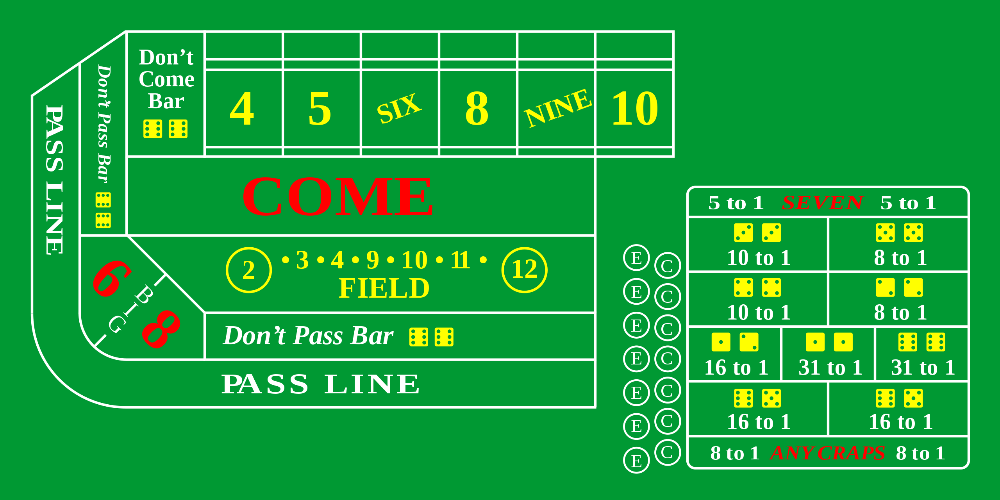

# Dice Flex

This project was created for fun and practice with Material UI 5 and flexbox. Passes props to a sibling component to roll dice from navbar component. Roll by clicking one of the red dice or upper right icon.

### Copyright 2022 Michael Saucedo

View dice at this [craps table](https://diceflex.netlify.app/).

 

  

